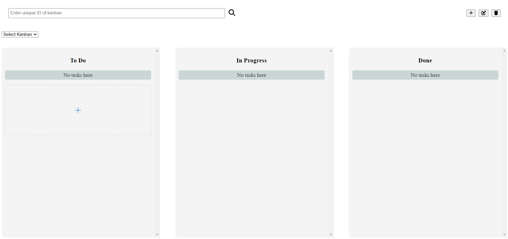
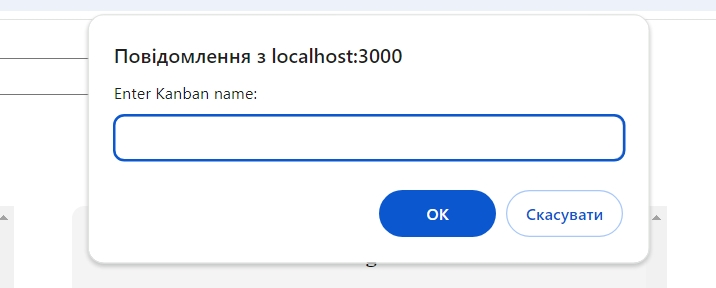
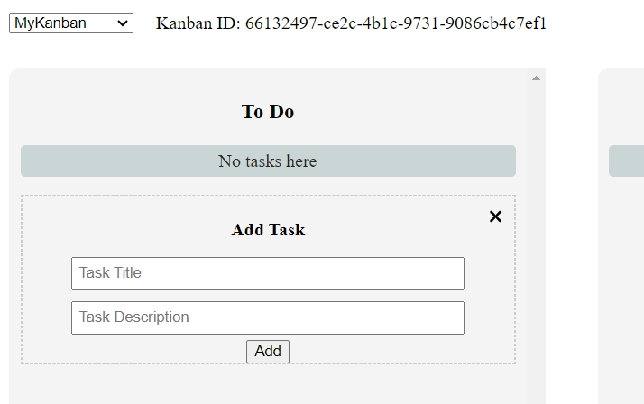
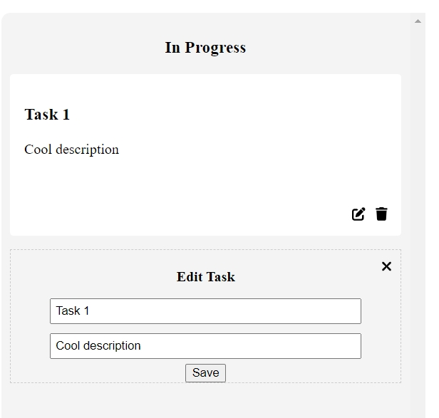
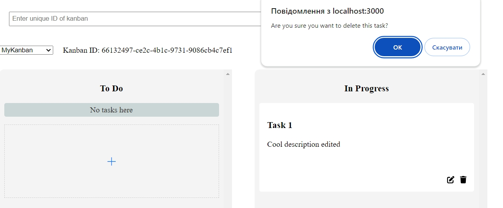
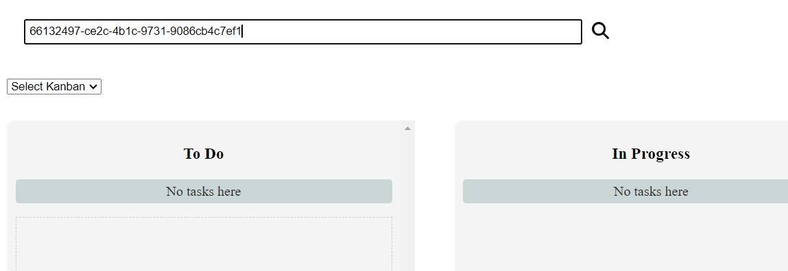
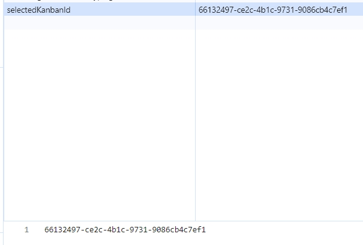

# Kanban

---

## _The Simple Board and Task Manager_

[](https://img.shields.io/badge/node.js-339933?style=for-the-badge&logo=Node.js&logoColor=white) [](https://img.shields.io/badge/Express%20js-000000?style=for-the-badge&logo=express&logoColor=white) [](https://img.shields.io/badge/postgresql-4169e1?style=for-the-badge&logo=postgresql&logoColor=white) [](https://shields.io/badge/TypeScript-3178C6?logo=TypeScript&logoColor=FFF&style=flat-square) [](https://shields.io/badge/react-black?logo=react&style=for-the-badge) [](https://img.shields.io/badge/docker-257bd6?style=for-the-badge&logo=docker&logoColor=white)

## About

---

✨ Kanban is very plain but comfy task manager, adapted to your browser. Any user can create board with unique id and inside it add draggable tasks. ✨

[](./assets/main.jpg)

## Features

---

- Add, edit and delete table (kanban)
- Add, edit and delete tasks bound to unique kanban
- Drag and drop tasks between columns and change its status in db dynamically
- Search by kanban unique id
- Save selected table id with localStorage
- Dockerized back-end and front-end

> This application's backend is deployed on Google Cloud and you can reach frontend part on netlify.

### How working app looks like

---

[](./assets/add_kanban.jpg)

[](./assets/add_task.jpg)

[](./assets/edit_task.jpg)

[](./assets/delete_task.jpg)

[](./assets/search_by_id.jpg)

[](./assets/local_storage.jpg)

## Tech

---

What was used to create this application:

- [Node.js](https://nodejs.org/en)
- [Express](https://expressjs.com/)
- [TypeScript](https://www.typescriptlang.org/)
- [React](https://react.dev/)
- [PostgreSQL](https://www.postgresql.org/)
- [TypeORM](https://typeorm.io/)
- [react-beautiful-dnd](https://github.com/atlassian/react-beautiful-dnd#readme)
- [Docker](https://www.docker.com/)

## Installation

---

If you are a developer, you will need [Node.js](https://nodejs.org/) v20+ to run.

Install the dependencies and devDependencies, create .env files, download official PostgreSQL and PG_Admin images from Docker, then build back-end container locally and start the server.

```sh
cd back-end
npm run build
docker-compose up --build
```

To see frontend magic after your server started, navigate into front-end folder and run the code:

```sh
cd front-end
npm run start
```

## License

---

ISC

**Free Software, Hell Yeah!**
